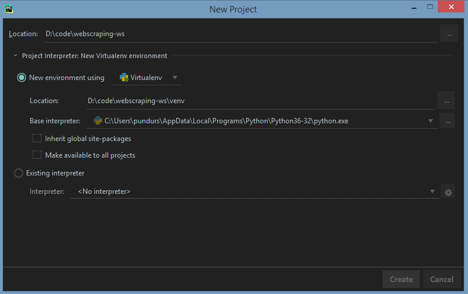
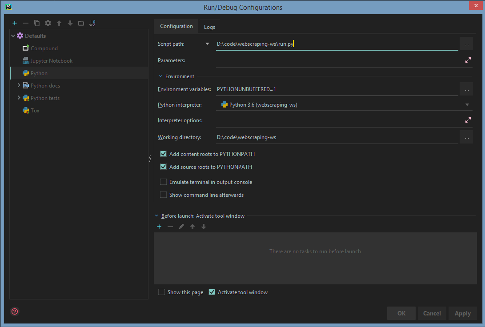

.. Web Scraping Workshop documentation master file, created by
   sphinx-quickstart on Wed Feb  7 23:12:21 2018.
   You can adapt this file completely to your liking, but it should at least
   contain the root `toctree` directive.

Python Web Scraping Workshop
=================================================

Hello and welcome to the workshop!

This site is here to help guide you through completing 3 tasks which should help you increase your understanding
about getting and storing data from the internet and to make you more comfortable with Python syntax!

You might find interesting that this page was built with `Sphinx <http://www.sphinx-doc.org>`__ - a tool which
most of the Python package authors use to generate their documentation, including the packages you're about to use -
`requests <http://docs.python-requests.org/en/master/>`__ and `BeatifulSoup <https://www.crummy.com/software/BeautifulSoup/bs4/doc/>`__!

Getting started
===============

I presume that you already have `PyCharm Community Edition <https://www.jetbrains.com/pycharm/download>`__ installed,
and have a working version of Python 3.6 (you can check by typing :code:`python3 -V` in your terminal).

So fire PyCharm up and click on *Create New Project*. A dialog will come up asking you where to put the project files.
To be sure that your project will be using Python 3.6, you can click on *Project Interpreter* to double check by looking
at the *Base Interpreter* drop down:

This will drop you right in the editor and you're basically ready to start hacking! One more thing though!

Create your first Python File by right-clicking in the project pane on the left. After that's done - in the top menu
click on *Run > Edit Configurations*. A dialog will come up which let's you tell PyCharm how to run your program. Pick
*Python* in the *Defaults* section. Set the *Script path* to point to your file and click *OK*:

Now you can conveniently run your script with *Shift-F10* and, if you're in a pickle, use the debugger with *Shift-F9*!

Now you're really locked, loaded and ready to start with :doc:`first`!

Also, If you've ran in trouble, feel free to call me up and we'll try and solve the issue, and if you don't finish the
tasks in time - at least you'll have something to keep you busy if you find yourself being bored!

.. toctree::
   :maxdepth: 1
   :caption: Tasks:

   first

:ref:`search`
